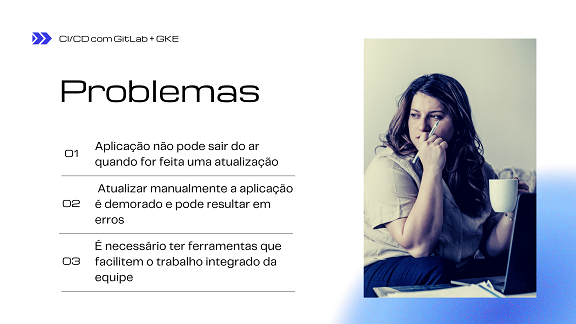
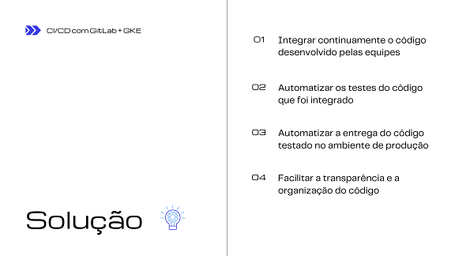
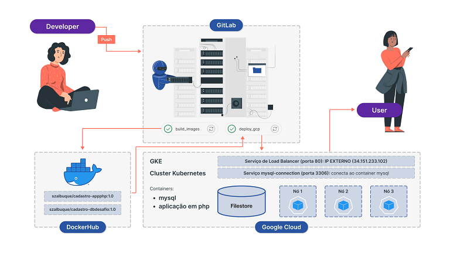

# Desafio final Dio.me / Banco Carrefour

## Objetivo:
Criar um pipeline de deploy desta aplicação em forma de containers em um cluster Kubernetes.
 O participante poderá utilizar um cluster kubernetes em nuvem (Preferencialmente utilizando
GCP).
 O pipeline de CI/CD poderá ser criado utilizando-se o Gitlab, Terraform ou outra solução desejada.

## Problema:

## Proposta:

## Solução:

## Este repositório contém:
* os arquivos da aplicação "Cadastro de usuários", nas pastas backend, db e frontend;
* os arquivos de geração das imagens docker (dockerfile):
  * na pasta backend: para gerar a imagem da aplicação em php;
  * na pasta db: para gerar a imagem do banco de dados MySQL;

## Imagens docker:
As imagens geradas estão nos repositórios:
* Banco de dados: szalbuque/cadastro-db-desafio:1.0
* Backend: szalbuque/cadastro-app-php:1.0

## Frontend:
* Uma página simples, usando html+css, com um botão que direciona para a aplicação backend
* Depois de criado o Load Balancer, no arquivo **index.html**, é necessário incluir **IP externo** do Load Balancer na linha:
  > window.open("http://localhost:8081");
* Esta página pode ser aberta em qualquer navegador, para acessar a aplicação.

# Cluster Kubernetes no Google Cloud
## Criação do cluster GKE
* Especificações do cluster

Item | Descrição
-----|----------
Name | cluster-app-cadastro	
Location type | Zonal	
Control plane zone | southamerica-east1-a	
Total size | 3	
Endpoint | 34.95.191.7

## Ativar o uso do Filestore pelo Cluster:
>  gcloud container clusters update cluster-app-cadastro --zone southamerica-east1-a --project bootcampdiome --update-addons=GcpFilestoreCsiDriver=ENABLED

## Criação do volume persistente para o banco de dados
* Especificações do volume Filestore (NFS):

Instance ID | File share name | Creation time | Service tier | Location | IP address | Capacity | Labels
------------|-----------------|---------------|--------------|----------|------------|----------|-------
gcpnfs | dados | 26.11.2022, 15:31:32 | BASIC_HDD | southamerica-east1-a | 172.31.43.194 | 1 TiB	

* Arquivo **persistentvolume.yml**:
  * Especificação do Persistent Volume, que faz a ligação com o compartilhamento NFS:  **172.31.43.194/dados**

* Arquivo **pvc.yml**:
  * Especificação do Persistent Volume Claim, com o nome de **mysql-dados**

## Verificação do volume persistente:
> kubectl describe pv

Item | Descrição
-----|----------
Name: | fileserver
Status: | Bound
Claim: | default/mysql-dados
Reclaim Policy: | Retain
Access Modes: | RWX
VolumeMode: | Filesystem
Capacity: | 1T
Type: | NFS (an NFS mount that lasts the lifetime of a pod)
Server: | 10.171.253.154
Path: | /dados
ReadOnly: | false

> kubectl describe pvc

Item | Descrição
-----|----------
Name: | mysql-dados
Namespace: | default
Status: | Bound
Volume: | fileserver
Annotations: |  pv.kubernetes.io/bind-completed: yes
Capacity:   |   1T
Access Modes: | RWX
VolumeMode:  |  Filesystem
Used By:    |   mysql-64fb768769-rndqm

## Implantação do container mysql
* Deploy:
> kubectl apply -f dbasedeploy.yml
* Ver o pod:
> kubectl get pods

NAME | READY | STATUS | RESTARTS | AGE
-----|-------|--------|----------|----
mysql-64fb768769-qs2qr |  1/1  |   Running |  0     |     10m

* Inspecionar o pod:
> kubectl describe pod mysql-64fb768769-qs2qr

Name:             mysql-64fb768769-qs2qr 
Namespace:        default 
Node:             gke-cluster-app-cadastro-default-pool-5c805f52-3qqv/10.158.0.16 
Start Time:       Sat, 26 Nov 2022 18:48:36 -0300 
Labels:           app=mysql 
Status:           Running 
IP:               10.100.1.6 
Containers: 
  mysql: 
    Image:         szalbuque/cadastro-db-desafio:1.0 
    Port:          3306/TCP 
    Mounts: 
      /var/lib/mysql from mysql-dados (rw) 
Volumes: 
  mysql-dados: 
    Type:       PersistentVolumeClaim (a reference to a PersistentVolumeClaim in the same namespace) 
    ClaimName:  mysql-dados 
    ReadOnly:   false 

## Implantação do container da aplicação backend (php)
* Na pasta backend, onde está o arquivo deployment.yml, rodar o comando:
> kubectl apply -f deployment.yml 
> kubectl get pods

NAME | READY | STATUS | RESTARTS | AGE
-----|-------|--------|----------|----
mysql-64fb768769-qs2qr |  1/1  |   Running |  0     |     10m
php-546ccdcb77-p8qsq  |   1/1  |   Running  | 0     |     95s

* Acessar o pod da aplicação para corrigir o IP do container MySQL no arquivo config.php:
> kubectl exec --tty --stdin php-546ccdcb77-p8qsq bash

## Implantação dos serviços: Load Balancer e MySQL-connection
> kubectl apply -f services.yml 
> kubectl get service

NAME       |        TYPE     |      CLUSTER-IP  |   EXTERNAL-IP   |   PORT(S)   |     AGE
-----------|-----------------|------------------|-----------------|-------------|--------
kubernetes |        ClusterIP  |    10.104.0.1   |  <none>       |    443/TCP   |     4h9m
mysql-connection  | ClusterIP  |    None         |  <none>       |    3306/TCP  |     97s
php-lb           |  LoadBalancer |  10.104.4.152 |  34.151.233.102 |  80:30855/TCP |  97s

